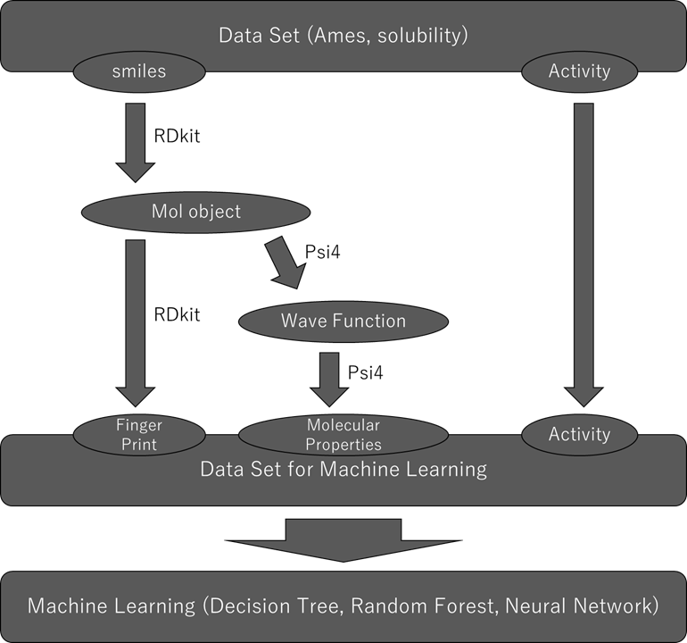

# MolPredictTest

## Demo
Here, we try to improve machine learning models for prediction of physical properties of molecules.
We are using psi4 to perform quantum chemical calculations and adding values derived from molecular wave functions to the training data to improve machine learning.

## Requirements
* python
* RDKit
* Psi4
* matplotlib
* numpy
* pandas
* pytorch
* scikit-learn

## Samples
* Ames data
* solubility data

